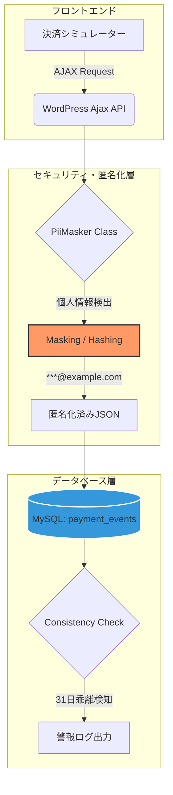
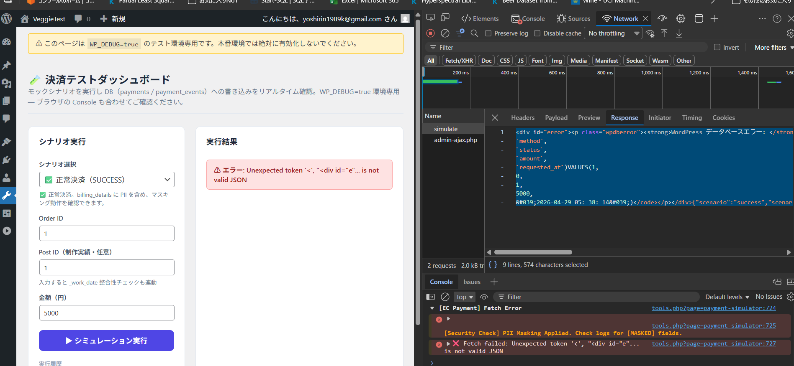
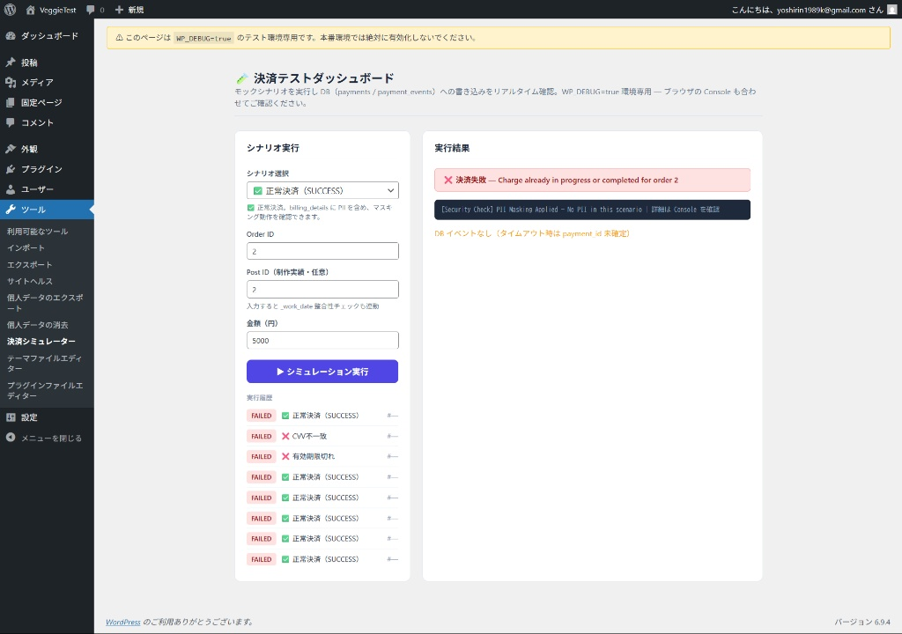

# Payment Event Logger Pipeline (PII Masking & DB Debugging)

## 概要
本プロジェクトは、農業法人向けECサイトの実運用を見据えた、WordPress環境における決済ログの匿名化パイプラインです。
単なるログ保存ではなく、データエンジニアリングの観点から**「データの完全性」「プライバシー保護」「デバッグによる信頼性確保」**を実証することを目的としています。

## 🏗 システムアーキテクチャ

このシステムは、個人情報（PII）を自動検知してマスキングし、安全な状態でMySQLへ永続化するデータパイプラインを構築しています。



## 🌟 主な機能と設計原則
1. **Privacy by Design**: `PiiMasker`クラスにより、カード番号やメールアドレスを保存直前に自動マスキング。
2. **データの完全性 (Completeness)**: 決済の成否に関わらず、全てのイベントを `payment_events` テーブルにJSON形式で保全。
3. **冪等性 (Idempotency)**: `FOR UPDATE`（排他制御）を用いた二重決済防止ロジックの導入。
4. **異常検知 (Consistency)**: 決済完了日時とデータの乖離を自動検知するロジックの実装。

## 🛠 トラブルシューティングの記録 (DE能力の証明)

開発過程で発生したデータベース不整合を、以下のプロセスで解決しました。

### 1. ネットワーク層からの原因特定
- **現象**: シミュレーター実行時に `Unexpected token '<'` エラーが発生。
- **解析**: ブラウザのNetworkタブを用いて、PHPが「Table doesn't exist」というHTMLエラーを返していることを特定。

### 2. スキーマ不整合の修正
- **現象**: テーブル作成後、`Unknown column 'method' in 'field list'` が発生。
- **解決策**: アプリケーションの要求仕様をリバースエンジニアリングし、`method` や `requested_at` カラムを含む最新のスキーマへDDLをアップデート。

## 📊 証跡 (Evidence)
- **PIIマスキングと実行成功の様子**:

- **DBスキーマとセキュリティチェックの検証**:

## 🗂 ディレクトリ構成

```text

wp-payment-logger-pipeline/
├── README.md               # プロジェクト概要・設計思想
├── docs/
│   └── evidence/           # 動作検証済みスクリーンショット
├── sql/
│   ├── setup_schema.sql    # 最終的なテーブル作成DDL
│   └── verification.sql    # 整合性検証用クエリ集
└── src/
    └── payment-logger.php  # プラグインのメインロジック (PHP 8.x)

```

## ⚠️ 注意事項
- 本プラグインは開発環境（`WP_DEBUG=true`）専用のシミュレーターです。
- 本番環境への導入時は、シミュレーター機能を無効化し、ロギングエンジンのみを切り出して使用してください。

---
**Author**: Moheji (Ko Sato)
**Project**: 農業法人ECサイト 決済エンジニアリング基盤構築